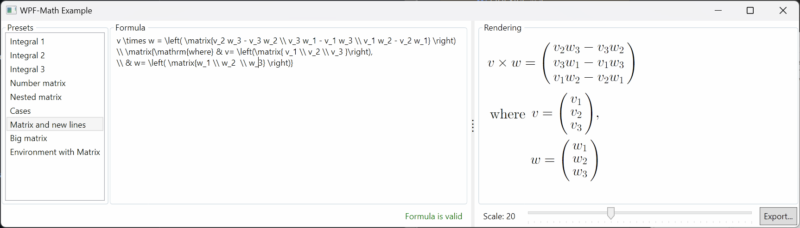

XAML-Math
=========

*XAML-Math* is a collection of .NET libraries for rendering mathematical formulae using the LaTeX typesetting style, for the WPF and [Avalonia][avalonia] XAML-based frameworks.

- For WPF, use NuGet package [WPF-Math][nuget-wpf]: [![NuGet][badge-nuget-wpf]][nuget-wpf]
- For Avalonia, use [Avalonia-Math][nuget-avalonia]: [![NuGet][badge-nuget-avalonia]][nuget-avalonia]

WPF-Math supports the following .NET variants:
- .NET Framework 4.6.2 or later
- .NET 6 or later

Avalonia-Math supports:
- .NET Framework 4.6.2 or later
- .NET Standard 2.0 or later
- .NET 6 or later

A part of XAML-Math independent of the UI frameworks is published on NuGet as [XAML-Math Shared Code][nuget-xaml]: [![NuGet][badge-nuget-xaml]][nuget-xaml]

Getting Started
---------------

The simplest way of using *XAML-Math* is to render a static formula in a XAML file as follows.

```xml
<!-- WPF -->
<Window … xmlns:controls="clr-namespace:WpfMath.Controls;assembly=WpfMath">
    <controls:FormulaControl Formula="\left(x^2 + 2 \cdot x + 2\right) = 0" />
</Window>

<!-- Avalonia -->
<Window … xmlns:controls="clr-namespace:AvaloniaMath.Controls;assembly=AvaloniaMath">
    <controls:FormulaBlock Formula="\left(x^2 + 2 \cdot x + 2\right) = 0" />
</Window>
```

For a more detailed sample, check out the [example project][example]. It shows the usage of data binding and some advanced concepts.



### Using the rendering API

The following example demonstrates usage of `TexFormula` API to render the image into a PNG file using the `RenderToPng` extension method:

```csharp
using System;
using System.IO;
using WpfMath.Parsers;
using WpfMath;
using XamlMath.Exceptions;

namespace ConsoleApplication2
{
    internal class Program
    {
        public static void Main(string[] args)
        {
            const string latex = @"\frac{2+2}{2}";
            const string fileName = @"T:\Temp\formula.png";

            try
            {
                var parser = WpfTeXFormulaParser.Instance;
                var formula = parser.Parse(latex);
                var pngBytes = formula.RenderToPng(20.0, 0.0, 0.0, "Arial");
                File.WriteAllBytes(fileName, pngBytes);
            }
            catch (TexException e)
            {
                Console.Error.WriteLine("Error when parsing formula: " + e.Message);
            }
        }
    }
}
```

Note that `XamlMath.TexFormulaParser::Parse` may throw a `XamlMath.Exceptions.TexException` if it was unable to parse a formula.

If you need any additional control over the image format, consider using the extension methods from the `WpfTeXFormulaExtensions` class:

```csharp
using System;
using System.IO;
using System.Windows.Media.Imaging;
using WpfMath.Parsers;
using WpfMath.Rendering;
using XamlMath;

const string latex = @"\frac{2+2}{2}";
const string fileName = @"T:\Temp\formula.png";

var parser = WpfTeXFormulaParser.Instance;
var formula = parser.Parse(latex);
var environment = WpfTeXEnvironment.Create(TexStyle.Display, 20.0, "Arial");
var bitmapSource = formula.RenderToBitmap(environment);
Console.WriteLine($"Image width: {bitmapSource.Width}");
Console.WriteLine($"Image height: {bitmapSource.Height}");

var encoder = new PngBitmapEncoder();
encoder.Frames.Add(BitmapFrame.Create(bitmapSource));
using (var target = new FileStream(fileName, FileMode.Create))
{
    encoder.Save(target);
    Console.WriteLine($"File saved to {fileName}");
}
```

You may also pass your own `IElementRenderer` implementation to `TeXFormulaExtensions::RenderTo` method if you need support for any alternate rendering engines.

Documentation
-------------

- [Changelog][docs.changelog]

- [Color support in XAML-Math][docs-colors]
- [Matrices and Matrix-Like Constructs][docs-matrices]
- [Environments (`\begin` and `\end`)][docs.environments]
- [How to improve blurred formulas][docs-blurred-text-issue]

- [How to prepare `DefaultTexFont.xml` from the font file][docs-prepare-font]

- [Licensing history][docs-licensing-history]

- [Maintainership][docs.maintainership]

Build and Maintenance Instructions
----------------------------------

Build the project using [.NET SDK 7.0][dotnet-sdk] or later. Here's the build and test script:

```console
$ dotnet build XamlMath.All.sln --configuration Release
$ dotnet test XamlMath.All.sln
```

To approve the test results if they differ from the existing ones, execute the `scripts/approve-all.ps1` script using PowerShell or PowerShell Core.

To publish the package, execute the following command:

```console
$ dotnet pack XamlMath.All.sln --configuration Release
```

For non-Windows systems, substitute `XamlMath.Portable.sln` instead of `XamlMath.All.sln`.

History
-------

The library was originally ported from the [JMathTex project][jmathtex], copyright 2004-2007 Universiteit Gent. The port was originally named *WPF-TeX* and was written and maintained by [Alex Regueiro][alex-regueiro]. It was later available as [*WPF-Math* on Launchpad][launchpad], but was unmaintained from 2011 until it 2017, when was revived in [its current form][github].

In 2023, after adding the Avalonia support, the *WPF-Math* project was renamed to *XAML-Math*.

License Notes
-------------

The project code and all the resources are distributed under the terms of [MIT license][license].

The [fonts][] `cmex10.ttf`, `cmmi10.ttf`, `cmr10.ttf`, and `cmsy10.ttf` and `cmtt10.ttf` are under the [Knuth License][knuth-license].

The font file `jlm_msam10.ttf` ([taken from JLaTeXMath project][jlatexmath.fonts]) is licensed under the [Open Font License][docs.open-font-license].

XAML-Math (named *WPF-Math* at the time) started as a direct port of [JMathTeX][jmathtex] project written in Java, reusing both code and resources. JMathTeX is distributed under the terms of GNU GPL v2 license. XAML-Math, being a derived work, has a permission from JMathTeX authors to be redistributed under the MIT license. See the [Licensing history][docs-licensing-history] for the details.

We're very grateful to JMathTeX authors for their work and allowing to redistribute the derived library. JMathTeX is written by:
- Kris Coolsaet
- Nico Van Cleemput
- Kurt Vermeulen

[docs-blurred-text-issue]: docs/blurred-text-issue.md
[docs-colors]: docs/colors.md
[docs-licensing-history]: docs/licensing-history.md
[docs-matrices]: docs/matrices.md
[docs-prepare-font]: docs/prepare-font.md
[docs.changelog]: ./CHANGELOG.md
[docs.environments]: docs/environments.md
[docs.maintainership]: ./MAINTAINERSHIP.md
[docs.open-font-license]: fonts/LICENSES.md
[example]: src/WpfMath.Example/
[fonts]: fonts/
[jlatexmath.fonts]: https://github.com/opencollab/jlatexmath/tree/af77a8e80d41ff67dfe2f42f14b41f6860dfeeec/jlatexmath/src/main/resources/org/scilab/forge/jlatexmath/fonts/maths
[license]: LICENSE.md

[alex-regueiro]: https://github.com/alexreg
[avalonia]: https://avaloniaui.net/
[dotnet-sdk]: https://dotnet.microsoft.com/download
[github]: https://github.com/ForNeVeR/xaml-math
[jmathtex]: http://jmathtex.sourceforge.net/
[knuth-license]: http://ctan.org/license/knuth
[launchpad]: https://launchpad.net/wpf-math
[msbuild]: https://github.com/Microsoft/msbuild
[nuget-avalonia]: https://www.nuget.org/packages/AvaloniaMath/
[nuget-wpf]: https://www.nuget.org/packages/WpfMath/
[nuget-xaml]: https://www.nuget.org/packages/XamlMath.Shared/

[badge-nuget-avalonia]: https://img.shields.io/nuget/v/AvaloniaMath.svg
[badge-nuget-wpf]: https://img.shields.io/nuget/v/WpfMath.svg
[badge-nuget-xaml]: https://img.shields.io/nuget/v/XamlMath.Shared.svg
