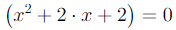
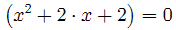

How to improve blurred formulas
======================================================

Since `FormulaControl` is a WPF control it has `TextOptions` properties
to tune how formulas are rendered. Default settings provides smooth and
clear output for large font sizes, but for smaller ones it may looks
blurred. It's a personal preference, and if you are unhappy with default
settings you may override it by creating custom style:

```xml
<Window ... xmlns:controls="clr-namespace:WpfMath.Controls;assembly=WpfMath">
    <Window.Resources>
        <Style x:Key="ClearTypeFormula" TargetType="controls:FormulaControl">
            <Setter Property="TextOptions.TextRenderingMode" Value="ClearType" />
            <Setter Property="TextOptions.TextHintingMode" Value="Fixed" />
            <Setter Property="TextOptions.TextFormattingMode" Value="Display" />
        </Style>
    </Window.Resources>

    <controls:FormulaControl Formula="\left(x^2 + 2 \cdot x + 2\right) = 0"
                             Style="{StaticResource ClearTypeFormula}" />
</Window>
```

Let's see on output for different settings.

- Default settings:



- ClearType style:



Second formula looks great with sharp symbols! But for larger font size it
might be not pleasible, so you may want to experiment with WPF rendering
options further.

If you still have problems with blurred/noisy formulas, please tell us in
this [umbrella issue](https://github.com/ForNeVeR/xaml-math/issues/50). We
are trying hard to achieve best-looking rendering on WPF, but sometimes it
might be tricky.

Thanks!
